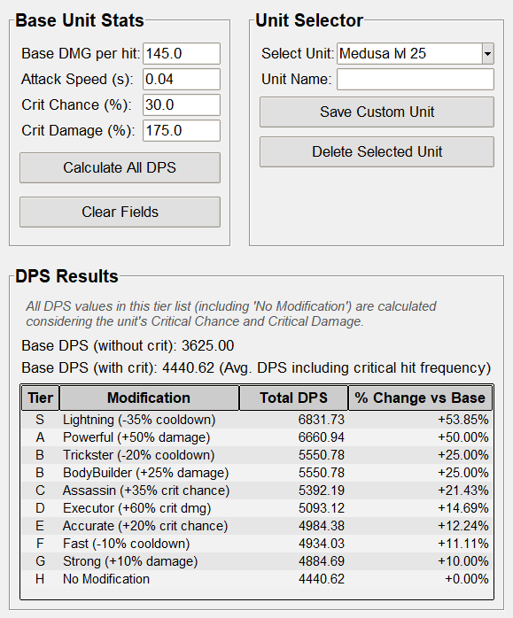

# DPS Calculator for UBG

A simple, intuitive desktop application for calculating and comparing the Damage Per Second (DPS) of various units in **Units Battlegrounds**. It helps players evaluate the impact of different modifications on their unit's performance by generating a comprehensive tiered list.

## Features

*   **Base Stat Input:** Easily enter your unit's core statistics (Damage, Attack Speed, Critical Chance, Critical Damage).
*   **Comprehensive DPS Calculation:** Calculates both raw DPS (without critical hits) and average DPS (factoring in critical hits).
*   **Modification Tier List:** Generates a sorted tier list of various predefined modifications (e.g., Powerful, Lightning, Executor, Assassin, Trickster, BodyBuilder, Accurate, Strong, Fast), showing the total DPS and percentage change compared to the base unit.
*   **Unit Management:** Allows you to save, load, and delete multiple unit configurations (e.g., "Medusa lvl 25").
*   **User-Friendly Interface:** Clean and intuitive Graphical User Interface (GUI) designed for ease of use.
*   **Light Theme by Default:** Starts with a bright, clean visual theme.

## Screenshots

Below is screenshot demonstrating the application's interface.

<!-- Make sure you have an 'images' folder in your repository with these files. -->
<!-- You can add more screenshots here if needed. -->



## How to Use

### 1. Running the Executable (Recommended for Windows Users)

For Windows users, the easiest way to use the application is by downloading the compiled executable:

1.  Go to the **[Releases page](https://github.com/HubSiteski/DPS_Calculator_for_UBG/releases)** of this repository.
2.  Download the latest `DPS_Calculator.exe` file from the assets of the newest release.
3.  Run the executable directly. No installation or Python setup is required.

### Windows Security Warning

When downloading and running the `.exe` file, **Windows may display a security warning** such as:
- "Microsoft Defender SmartScreen prevented an unrecognized app from starting"
- "Unknown publisher" 
- "This app might harm your device"

**This is completely normal for new applications.** The warning appears because:
- The application is not digitally signed (which costs $400+ per year for independent developers)
- Windows doesn't "recognize" the application yet
- **The application IS safe to use**

#### How to run the application:

1. **If you see a SmartScreen warning:**
   - Click **"More info"** in the warning dialog
   - Click **"Run anyway"** at the bottom
   - The application will start normally

2. **If your antivirus blocks the file:**
   - Temporarily disable real-time protection
   - Run the application
   - Re-enable protection afterward
   - Or add the file to your antivirus whitelist

3. **Alternative:** You can always run from source code (see section below) if you prefer

**Note:** This warning may become less frequent over time as more users download and run the application, helping Windows build trust in the software.

### 2. Running from Source (for Developers / Python Users)

If you prefer to run the application directly from its Python source code:

1.  **Prerequisites:**
    *   Ensure you have [Python 3.x](https://www.python.org/downloads/) installed on your system.
    *   `tkinter` (Python's standard GUI library) is typically included with Python installations.
    *   You need Git installed to clone the repository.
2.  **Clone the repository:**
    Open your terminal or command prompt and run:
    ```bash
    git clone https://github.com/HubSiteski/DPS_Calculator_for_UBG.git
    cd DPS_Calculator_for_UBG # Navigate into the project directory
    ```
3.  **Run the application:**
    ```bash
    python dps_calculator.py
    ```

### How to Use the Application Interface

1.  **Base Unit Stats:** Input your unit's core statistics (Damage, Attack Speed, Crit Chance, Crit Damage).
2.  **Unit Selector:**
    *   **Load/Save Units:** Use this panel to save your current unit's stats under a custom name or load a previously saved unit configuration (e.g., "Medusa lvl 25").
    *   **Medusa lvl 25:** A default unit configuration is pre-loaded for convenience.
3.  **DPS Results:**
    *   Click the "Calculate All DPS" button to generate a tiered list showing the effectiveness of all available modifications.
    *   The list will display "Total DPS" and "% Change vs Base" for each modification, sorted from highest to lowest DPS.
    *   A small informational line below the "DPS Results" title clarifies that all DPS values are calculated including critical hit frequency.

## License

This project is licensed under the [GNU General Public License v3.0](LICENSE).
